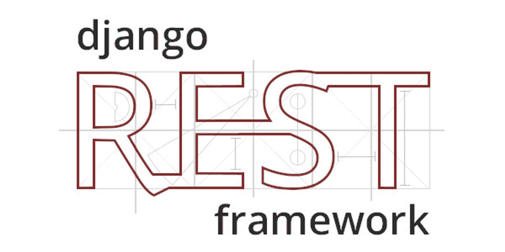

# :bookmark_tabs: Books

## :pager: Стэк
- **Python**
- **Django**
- **Postgres**
- **Docker**

## Описание
API на Django Rest Framework. Присутствует возможность авторизации по профилю github

## Установка

### 1) Из директории, где расположен файл Dockerfile, выполните команду 
    docker-compose up --build

### 2) Перейти по адресу
     http://127.0.0.1:8000/
---

### Создать администратора
    docker-compose exec django python manage.py createsuperuser

###  Тесты
     docker-compose exec django python manage.py test
### Документация доступна по адресу: 
    http://127.0.0.1:8000/swagger/